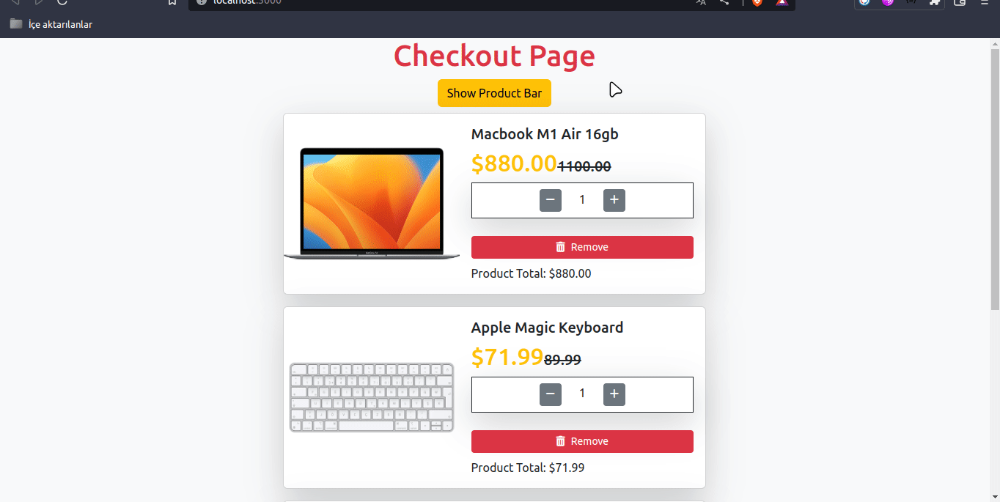
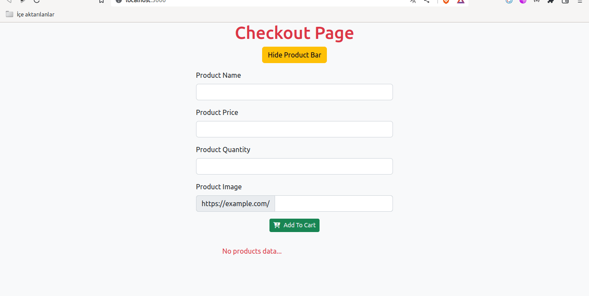

<p>Clarusway</p>

# Checkout Page

## Description

Project aims to create a Checkout Page App.

## Problem Statement

- We are adding a new project to our portfolios. So you and your colleagues have started to work on the project.

## Project Skeleton

```
004 - Checkout Page (folder)
|
|----readme.md         # Given to the students (Definition of the project)
SOLUTION
├── public
│     └── index.html
├── src
│   ├── App.css
│   ├── App.js
│   ├── components
│   │   ├── AddProduct.jsx
│   │   ├── Button.jsx
│   │   ├── CardTotal.jsx
│   │   ├── Header.jsx
│   │   └── ProductCard.jsx
│   ├── helper
│   │   └── data.js
│   ├── index.css
│   ├── index.js
│   └── pages
│       └── Main.jsx
├── package.json
└── yarn.lock

```

## Expected Outcome



## Objective

Build a Checkout Page App using ReactJS.

### At the end of the project, following topics are to be covered;

- HTML

- CSS

- JS

- ReactJS

### At the end of the project, students will be able to;

- improve coding skills within HTML & CSS & JS & ReactJS.

- use git commands (push, pull, commit, add etc.) and Github as Version Control System.

## Steps to Solution

- Step 1: Create React App using `npx create-react-app checkout-page`

- Step 2 : Install `"react-icons"` package to your `package.json` for icons or fontawesome cdn link paste to "public/index.html".

- Step 3: Build Checkout Page App.

- Step 4: You can use CSS frameworks like Bootstrap, Material UI etc.

- Step 5: Push your application into your own public repo on Github

- Step 6: Add project gif to your project and README.md file.

## Notes

- You can add additional functionalities(storage or mockApi etc.) to your app.
## Demo
  <a href="https://checkoutpage-react.vercel.app/" target="_blank">React Checkout Page</a>

# Checkout Page with Axios


## Expected Outcome


## Steps to Solution

- Step 1: Create React App using `npx create-react-app checkout-axios`

- Step 2 : Install `"react-icons"` package to your `package.json` for icons or fontawesome cdn link paste to "public/index.html" and install `axios` package.

- Step 3: Build Checkout Page App.

- Step 4: You can use CSS frameworks like Bootstrap, Material UI etc.

- Step 5: Push your application into your own public repo on Github

- Step 6: Add project gif to your project and README.md file.

## Notes

- You can add additional functionalities(storage or mockApi etc.) to your app.

## Demo
  <a href="https://checkout-axios.vercel.app/" target="_blank">React Checkout Page with Axios</a>

## MockApi

<a href="https://mockapi.io/" target="_blank">MockApi</a>


## How do we create mockApi? Watch the video!
<a href="https://www.youtube.com/watch?v=i_Gvlp83GMk" target="_blank">
 
</a>

- Or you can find **MockApi quick start guide** <a href="https://github.com/mockapi-io/docs/wiki/Quick-start-guide" target="_blank">here</a>


**<p align="center">&#9786; Happy Coding &#9997;</p>**
